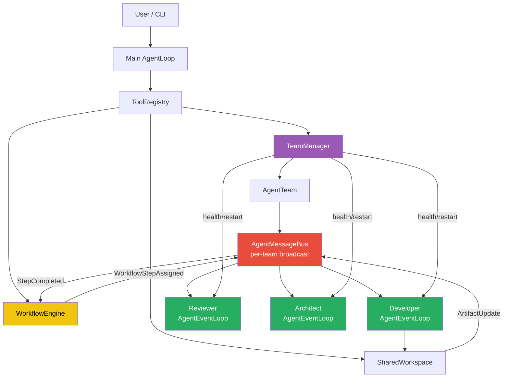
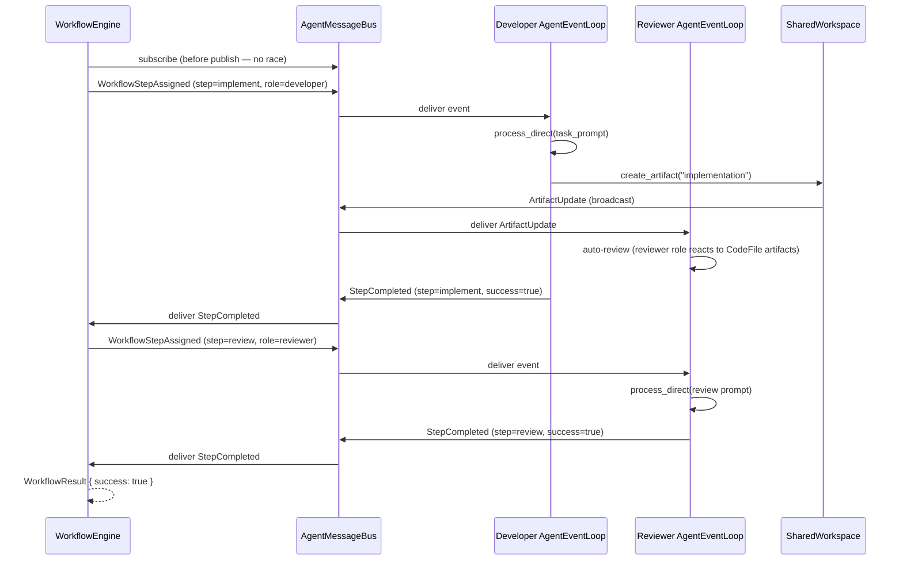

# Multi-Agent Collaboration

mofaclaw supports event-driven multi-agent collaboration where teams of specialized agents
work concurrently, communicate via a per-team message bus, and coordinate through a workflow
engine — replacing the single-agent-loop model with N persistent, autonomous agents.

---

## Architecture

```
User / CLI
    |
    v
Main AgentLoop  (tool calls)
    |
    +---> TeamManager -----> creates AgentTeam
    |         |                   |
    |         |             AgentMessageBus  <--- per team, broadcast channel
    |         |                   |
    |         |      +------------+------------+
    |         |      |            |            |
    |         v      v            v            v
    |      Developer Agent   Reviewer Agent   Architect Agent
    |      (AgentEventLoop)  (AgentEventLoop) (AgentEventLoop)
    |           |                 |               |
    |           +-----------------+---------------+
    |                             |
    |                             v
    |                      SharedWorkspace (create/update artifacts)
    |                             |
    |                             | ArtifactUpdate (broadcast via TeamManager
    |                             |  to every active team's AgentMessageBus)
    |                             v
    |                      AgentMessageBus  <--- all agents receive
    |
    +---> WorkflowEngine
              |
              | WorkflowStepAssigned event
              +---------> AgentMessageBus
                               |
              StepCompleted <--+
```



### Key properties

| Property | Detail |
|---|---|
| One `AgentLoop` per member | Each agent has its own LLM context, session, and tool registry |
| Persistent concurrent tasks | Each member runs as a `tokio::spawn`'d `AgentEventLoop` task |
| Per-team message bus | `AgentMessageBus` is a `tokio::sync::broadcast` channel (cap 1000) scoped to one team |
| Event-driven workflow | `WorkflowEngine` publishes `WorkflowStepAssigned`, waits for `StepCompleted` — never calls agents directly |
| Artifact events | `SharedWorkspace` broadcasts `ArtifactUpdate` to all team buses; reviewer agents auto-trigger a review of code artifacts |
| Health monitoring | `LoopHealthCounters` track heartbeat, events processed, errors per loop |
| Auto-restart | Background supervisor automatically restarts dead loops; `TeamManager::restart_dead_loops()` also available for manual use |
| Auto-restore on startup | Event-driven teams are automatically restored from disk on process start |
| Peer-to-peer consultation | Agents can send messages and wait for responses mid-step using `send_agent_message` + `wait_for_agent_response` |
| Graceful shutdown | `watch::Sender<bool>` per team; `remove_team()` signals all member loops |

---

## Core Components

### AgentEventLoop (`core/src/agent/collaboration/event_loop.rs`)

A persistent async wrapper around `AgentLoop`. Spawned once per team member, runs until a
shutdown signal is received.

```rust
pub struct AgentEventLoop {
    pub agent_id: AgentId,
    agent_loop: Arc<AgentLoop>,
    event_bus: Arc<AgentMessageBus>,
    workspace: Arc<SharedWorkspace>,
    state: Arc<RwLock<EventLoopState>>,  // Idle | Running | ShuttingDown | Stopped
    health: Arc<LoopHealthCounters>,     // shared with TeamManager
    step_timeout: Duration,              // max time for a single process_direct call
}
```

**Event dispatch table:**

| Message type | Default reaction |
|---|---|
| `WorkflowStepAssigned` | Execute the step via `process_direct`, reply with `StepCompleted` |
| `ArtifactUpdate` | Log; reviewer agents auto-trigger a review of code artifacts |
| `Request` | Run payload through `process_direct`, reply with `Response` |
| `StepCompleted` | Ignored (consumed by WorkflowEngine) |
| `Response` | Ignored (consumed by `wait_for_agent_response` tool) |
| `Broadcast` | Ignored |

**Health counters** updated atomically on every loop iteration:

```rust
pub struct LoopHealthCounters {
    pub events_processed: AtomicU64,   // messages where should_receive was true
    pub errors: AtomicU64,             // lagged messages, non-fatal errors
    pub last_heartbeat_secs: AtomicU64,// unix timestamp of last loop tick
}
```

### AgentMessageBus (`core/src/agent/communication/bus.rs`)

A `tokio::sync::broadcast` channel scoped to one team.

```rust
// Subscribe — every member gets their own Receiver
let rx = bus.subscribe_agent(&agent_id);

// Publish — delivered to all subscribers
bus.publish(msg).await?;

// Routing filter (called inside AgentEventLoop)
bus.should_receive(&msg, &agent_id)
// true if: message.to == agent_id  ||  broadcast  ||  ArtifactUpdate
```

Message types:

```rust
pub enum AgentMessageType {
    WorkflowStepAssigned { workflow_id, step_id, step_name, role, task_prompt, .. },
    StepCompleted        { workflow_id, step_id, success, output, error, .. },
    Request              { request_type, payload },
    Response             { request_id, success, payload },
    Broadcast            { topic, payload },
    ArtifactUpdate       { artifact_id, version, change_summary },
}
```

### WorkflowEngine (`core/src/agent/collaboration/workflow.rs`)

Coordinates multi-step workflows by publishing events — never calls agents directly.



Built-in workflows:

| Name | Steps |
|---|---|
| `code_review` | developer implement → (reviewer review ‖ tester test) → reviewer final_approval |
| `design` | architect design → developer feasibility → architect refine |

Custom workflow:

```rust
let workflow = Workflow::new("my-wf", "My Workflow", vec![
    WorkflowStep {
        id: "design".into(),
        name: "Design".into(),
        role: "architect".into(),
        task_prompt: "Design the authentication system".into(),
        required_artifacts: vec![],
        produces_artifacts: vec!["design_doc".into()],
        approval_required: false,
        approver_role: None,
        timeout: None,
    },
    WorkflowStep {
        id: "implement".into(),
        name: "Implement".into(),
        role: "developer".into(),
        task_prompt: "Implement based on the design doc".into(),
        required_artifacts: vec!["design_doc".into()],
        produces_artifacts: vec!["implementation".into()],
        approval_required: false,
        approver_role: None,
        timeout: None,
    },
]);
```

### SharedWorkspace (`core/src/agent/collaboration/workspace.rs`)

Versioned artifact store shared by all team members. On artifact create/update, broadcasts
`ArtifactUpdate` to every active team's bus via `Weak<TeamManager>`.

```rust
// Artifacts are versioned — each update increments the version
let artifact = workspace.create_artifact(
    "my-code", "main.rs",
    ArtifactType::CodeFile { path: PathBuf::from("main.rs") },
    ArtifactContent::FileContent { content: "fn main() {}".into() },
    agent_id.clone(),
).await?;

let updated = workspace.update_artifact(
    "my-code",
    ArtifactContent::FileContent { content: "fn main() { println!(\"hi\"); }".into() },
    agent_id.clone(),
).await?;

println!("version: {}", updated.version); // 2
```

Artifact types: `CodeFile`, `DesignDoc`, `TestFile`, `ReviewComment`, `Other`

### TeamManager (`core/src/agent/collaboration/team.rs`)

Creates teams, spawns event loops, tracks health, handles persistence.

```rust
// Create with persistence (team metadata survives restarts)
let manager = Arc::new(
    TeamManager::with_persistence(config, bus, sessions, data_dir).await
);
TeamManager::set_self_ref(&manager).await;

// Attach workspace (required for event loops to be spawned)
let workspace = Arc::new(SharedWorkspace::new("main", PathBuf::from(data_dir)));
TeamManager::set_workspace(&manager, workspace).await;

// Start background health supervisor (automatically restarts dead loops)
TeamManager::start_health_supervisor(&manager, std::time::Duration::from_secs(30));

// Restore event-driven teams from previous session (runs in background)
TeamManager::restore_event_driven_teams_background(&manager);

// Create team — spawns one AgentEventLoop per member
let team = manager.create_team(
    "my-team", "My Team",
    vec![
        ("architect".into(), "arch-1".into()),
        ("developer".into(), "dev-1".into()),
        ("reviewer".into(), "rev-1".into()),
    ],
).await?;

// Remove team — sends shutdown signal to all member loops
manager.remove_team("my-team").await;
```

### Role System (`core/src/agent/roles/`)

Each agent gets a role-specific system prompt, tool set, and LLM parameters.

| Role | Can write | Can exec | Temperature | Tools |
|---|---|---|---|---|
| `architect` | no | no | 0.3 | read_file, list_dir, web_search, message |
| `developer` | yes | yes | 0.7 | all tools |
| `reviewer` | no | no | 0.2 | read_file, list_dir, web_search, message |
| `tester` | yes (tests only) | yes | 0.5 | read_file, write_file, exec, message |

Adding a new role: implement `AgentRole` trait in `core/src/agent/roles/`, register in
`RoleRegistry::new()`.

---

## Health Monitoring

Every event loop publishes atomics that `TeamManager` can read without inter-task messaging.

```rust
// Per-team health report
let statuses: Vec<EventLoopStatus> = manager.team_health("my-team").await;
for s in statuses {
    println!(
        "{}: alive={} events={} errors={} secs_since_heartbeat={:?}",
        s.agent_id, s.is_alive, s.events_processed, s.errors, s.secs_since_heartbeat
    );
}

// All teams at once
let all: HashMap<String, Vec<EventLoopStatus>> = manager.all_team_health().await;

// Restart any loops whose JoinHandle has finished unexpectedly
let restarted: usize = manager.restart_dead_loops("my-team").await;
if restarted > 0 {
    println!("Restarted {} dead loops", restarted);
}
```

`EventLoopStatus` fields:

| Field | Type | Meaning |
|---|---|---|
| `agent_id` | `AgentId` | Which agent |
| `is_alive` | `bool` | `JoinHandle::is_finished()` is false |
| `events_processed` | `u64` | Messages handled since last spawn |
| `errors` | `u64` | Lagged/non-fatal errors |
| `secs_since_heartbeat` | `Option<u64>` | Seconds since last loop tick; `None` if not started |

A stale `secs_since_heartbeat` (e.g. > 30s) with `is_alive = true` indicates a stuck loop
(blocked on a long `process_direct` call). `is_alive = false` means the task exited.

**Automatic health monitoring:** `TeamManager::start_health_supervisor()` spawns a background
task that periodically checks all teams and automatically restarts any dead loops. This runs
continuously and requires no manual intervention. The supervisor uses a `Weak` reference to
`TeamManager`, so it stops automatically when the manager is dropped.

---

## Peer-to-Peer Communication

Agents can consult each other mid-step using `send_agent_message` and `wait_for_agent_response`
tools. This enables real-time collaboration during workflow execution.

**Flow:**
1. Agent A calls `send_agent_message(to=agent_b, correlation_id="abc", payload="question")`
2. Agent A calls `wait_for_agent_response(correlation_id="abc", timeout_secs=30)`
3. Agent B's `AgentEventLoop` receives the `Request` event
4. Agent B processes it via `process_direct` and publishes a `Response` with matching `correlation_id`
5. Agent A's `wait_for_agent_response` tool receives the response and returns it to the LLM
6. Agent A continues reasoning with the answer

**Example:**
```rust
// Developer agent (mid-step) asks reviewer for feedback
send_agent_message(
    team_id: "my-team",
    from_agent_id: "my-team:developer:dev-1",
    to_agent_id: "my-team:reviewer:rev-1",
    request_type: "ask_question",
    payload: {"question": "Is this pattern safe?"},
    correlation_id: "q-123"
)

// Wait for response (blocks until response arrives or timeout)
wait_for_agent_response(
    team_id: "my-team",
    correlation_id: "q-123",
    timeout_secs: 30
)
// Returns: {"success": true, "from": "my-team:reviewer:rev-1", "response": {"response": "Yes, looks safe"}}
```

**Safety:** Timeout prevents deadlock. If two agents wait for each other simultaneously, both
timeout after N seconds and continue with degraded information.

---

## CLI Usage

```bash
# Create a team (spawns AgentEventLoop per member)
mofaclaw team create \
  --id my-team \
  --name "My Team" \
  --roles "architect:arch-1,developer:dev-1,reviewer:rev-1"

# List teams (includes persisted-but-inactive teams from previous sessions)
mofaclaw team list

# Start a workflow
mofaclaw workflow start --name code_review --team my-team

# List active workflows
mofaclaw workflow list

# Browse workspace artifacts
mofaclaw workspace list --team my-team
mofaclaw workspace show --team my-team <artifact-id>
```

---

## Programmatic API

```rust
use mofaclaw_core::{
    Config, MessageBus, SessionManager, load_config,
    agent::collaboration::{
        team::TeamManager,
        workspace::SharedWorkspace,
        workflow::{WorkflowEngine, create_code_review_workflow},
    },
};
use std::{collections::HashMap, path::PathBuf, sync::Arc};

#[tokio::main]
async fn main() -> anyhow::Result<()> {
    let config = Arc::new(load_config().await?);
    let sessions = Arc::new(SessionManager::new(&config));

    // Set up manager with persistence and workspace
    let data_dir = PathBuf::from(config.data_dir());
    let manager = Arc::new(
        TeamManager::with_persistence(config.clone(), MessageBus::new(), sessions, data_dir.clone()).await
    );
    TeamManager::set_self_ref(&manager).await;

    let workspace = Arc::new(SharedWorkspace::new("main", data_dir)
        .with_team_manager(Arc::downgrade(&manager)));
    TeamManager::set_workspace(&manager, workspace).await;

    // Start background health supervisor (automatically restarts dead loops)
    TeamManager::start_health_supervisor(&manager, std::time::Duration::from_secs(30));

    // Restore event-driven teams from previous session (runs in background)
    TeamManager::restore_event_driven_teams_background(&manager);

    // Create team — event loops spawn automatically
    let team = manager.create_team(
        "cr-team", "Code Review Team",
        vec![
            ("architect".into(), "arch-1".into()),
            ("developer".into(), "dev-1".into()),
            ("reviewer".into(), "rev-1".into()),
            ("tester".into(),    "test-1".into()),
        ],
    ).await?;

    // Check health before kicking off work
    for s in manager.team_health("cr-team").await {
        assert!(s.is_alive, "loop {} is dead", s.agent_id);
    }

    // Execute workflow — engine coordinates via message bus
    let engine = WorkflowEngine::new().with_event_driven();
    let result = engine
        .execute_workflow(create_code_review_workflow(), team, HashMap::new())
        .await?;

    println!("completed {} steps, success={}", result.completed_steps, result.success);

    // Cleanup — shuts down all event loops
    manager.remove_team("cr-team").await;
    Ok(())
}
```

---

## Natural Language (Skill)

The `multi-agent` skill makes this accessible via chat:

> "review my code", "review this architecture", "have the team work on X"

The skill triggers `create_team` + `start_workflow` tool calls through the main agent loop.
Skill definition: `skills/multi-agent/SKILL.md`.

---

## Testing

201+ tests, all passing:

```bash
cargo test -p mofaclaw-core
```

Test coverage for this subsystem:

| File | What is tested |
|---|---|
| `event_loop.rs` (inline) | `LoopHealthCounters` atomics, state transitions, message round-trips |
| `event_loop_tests.rs` | Loop lifecycle, shutdown signal, bus closed, message filtering, workspace set after creation, duplicate teams, health checks, restart logic |
| `collaboration/tests.rs` | Workflow execution, artifact versioning, bus routing |
| `communication/bus.rs` (inline) | Publish/subscribe, broadcast, topic subscriptions, `should_receive` filtering |
| `tools/agent_message.rs` (tests) | `WaitForAgentResponseTool` timeout, correlation_id matching, team not found |

---

## File Structure

```
core/src/agent/
├── roles/
│   ├── mod.rs          # RoleRegistry
│   ├── base.rs         # AgentRole trait, RoleCapabilities
│   ├── architect.rs
│   ├── developer.rs
│   ├── reviewer.rs
│   └── tester.rs
│
├── communication/
│   ├── mod.rs
│   ├── protocol.rs     # AgentMessage, AgentId, AgentMessageType, RequestType
│   └── bus.rs          # AgentMessageBus
│
└── collaboration/
    ├── mod.rs
    ├── event_loop.rs   # AgentEventLoop, EventLoopState, LoopHealthCounters
    ├── team.rs         # TeamManager, AgentTeam, TeamMember, EventLoopStatus
    ├── workflow.rs     # WorkflowEngine, Workflow, WorkflowStep
    ├── workspace.rs    # SharedWorkspace, Artifact, ArtifactType
    ├── tests.rs
    └── event_loop_tests.rs

core/src/tools/
├── agent_message.rs    # SendAgentMessageTool, BroadcastToTeamTool, RespondToApprovalTool, WaitForAgentResponseTool
├── team.rs             # CreateTeamTool, ListTeamsTool, GetTeamStatusTool
├── workflow.rs         # StartWorkflowTool, ListWorkflowsTool, GetWorkflowStatusTool
├── workspace.rs        # CreateArtifactTool, GetArtifactTool, ListArtifactsTool
└── multi_agent.rs      # register_multi_agent_tools()

skills/multi-agent/
├── SKILL.md        # trigger phrases, workflow selection table, agent instructions
└── manifest.json   # tool permissions for hub compatibility
```
